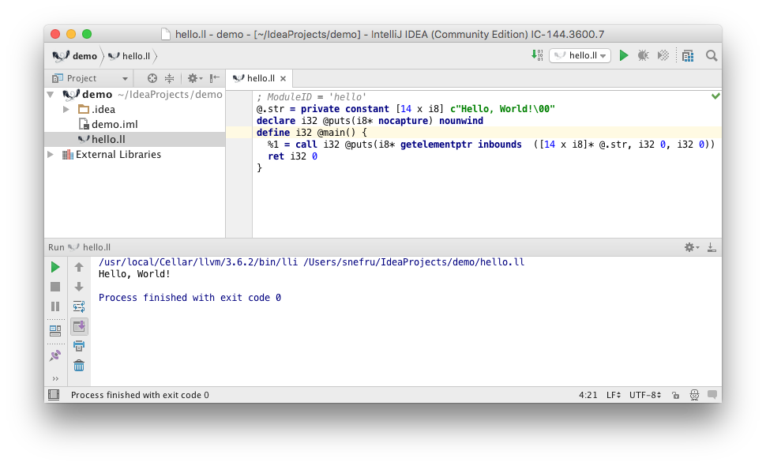

#LLVM Intellij Plugin 
                      
[LLVM](http://llvm.org) [Intellij](http://www.jetbrains.org/pages/viewpage.action?pageId=983889) Editor Plugin

##Overview

###Grammar

Underlying grammar defined in the following [Syntax Diagrams](http://snefru.github.io/io.alef.llvm/syntax-diagrams.xhtml).

###Snapshots

##To Install as a Plugin

* Download and install [IntelliJ Community Edition (Free) or Ultimate (Paid) ](https://www.jetbrains.com/idea/download/) 
* Go to Preferences > Plugins > Browse Repositories and search For "LLVM" 
* Click install 
* Click restart intellij

Alternatively 
* Download the [plugin jar](https://plugins.jetbrains.com/plugin/9283) to your local disk
*  Go to Preferences > Plugins > Install plugin from disk and choose the file you downloaded

##To Develop

###Requirements

1. [Java 8](http://www.oracle.com/technetwork/java/javase/downloads/jdk8-downloads-2133151.html)
2. [Gradle](https://gradle.org)

###To Run
   
    git clone https://github.com/snefru/io.vypa.llvm.git
    cd io.vypa.llvm
    gradle runIdea
    Configure the Project SDK to point to the root of the local LLVM installation

##References
1. [LLVM Language Reference Manual](http://llvm.org/docs/LangRef.html)
2. [LLVM Logos and Usage Rights](http://llvm.org/Logo.html)
3. [Go Language Plugin](https://github.com/go-lang-plugin-org/go-lang-idea-plugin)
